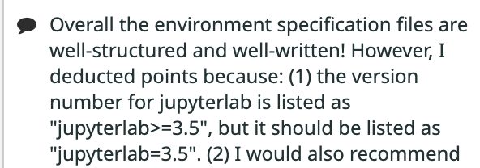
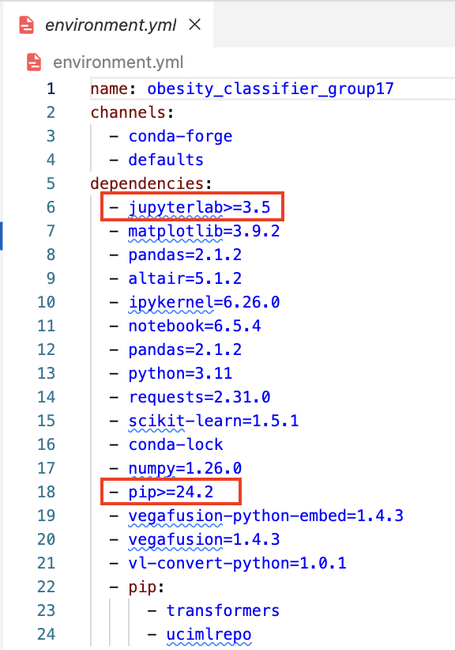
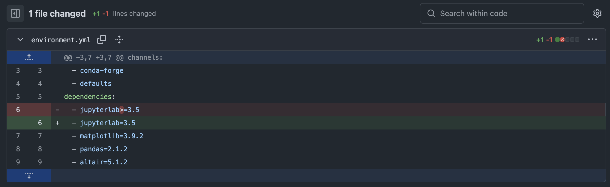

# Changelog

This document contains records of the improvements we have made to our project based on the feedback we have received from the DSCI 522 teaching team and peer reviews.\
Each section highlights the feedback provided, the state of teh project before the change, and the state of teh project after improvements.

## Improvement 1

Our environment.yml file did not list dependencies correctly. We did not specify version directly, but listed it as >=3.5

**Feedback received**

**Initial state (before improvement)**

**After improvement**

[Commit 8210652](https://github.com/UBC-MDS/obesity-classifier-group17/commit/8210652a3081cb35eca308751275b016555b41e4)

## 1. Improvement

<Describe>

**Feedback received**

**Initial state (before improvement)**

**After improvement**

