# Changelog

This document contains records of the improvements we have made to our project based on the feedback we have received from the DSCI 522 teaching team and peer reviews.\
Each section highlights the feedback provided, the state of teh project before the change, and the state of teh project after improvements.

## Improvement 1

Our `environment.yml` file initially listed dependencies incorrectly. Feedback from TA informed us that we did not pin version directly using `=`, but used `>=` instead.\
Upon review, a mistake in version specification for `ucimlrepo` was also found (`ucimlrepo==0.0.7` instead of `ucimlrepo=0.0.7`). 

### Changes made
- Updated `jupyterlab>=3.5` to `jupyterlab=3.5`
- Updated `pip>=24.2` to `pip=24.2`
- Updated `ucimlrepo==0.0.7` to `ucimlrepo=0.0.7`

Improvement by: Sepehr

**Feedback received**

**Initial state (before improvement)**

**After improvement**

Link to commit changes:\
[Commit 8210652](https://github.com/UBC-MDS/obesity-classifier-group17/commit/8210652a3081cb35eca308751275b016555b41e4)\
[Commit 82cd5b7](https://github.com/UBC-MDS/obesity-classifier-group17/commit/82cd5b77c53619cad695880a5edc2d8e307e5cc9#diff-9efd195f4e9bfb79ccd456a1d8370fafcc4bcb0b00ea3799222667d2ae818533L20)

## Improvement 2

The following feedback was provided by the TA for Milestone 1 regarding our Summary and Introduction section:

**Feedback received**\
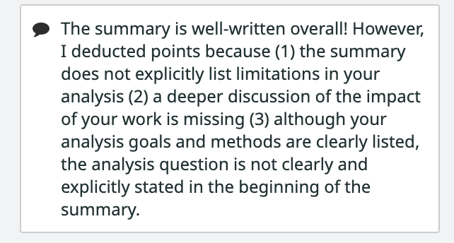\
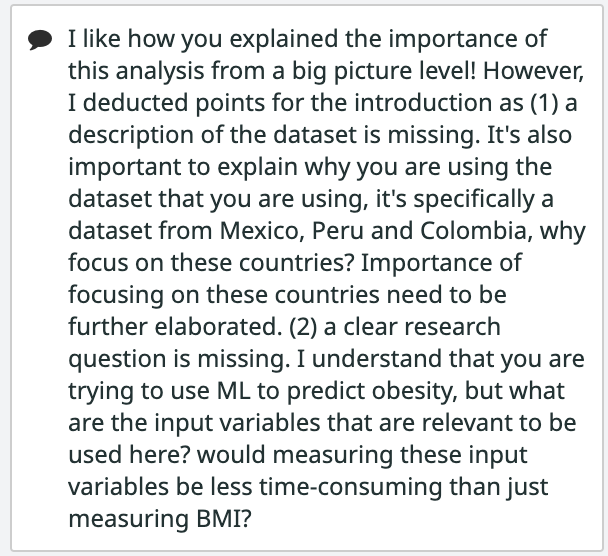

**Initial state (before improvement)**\
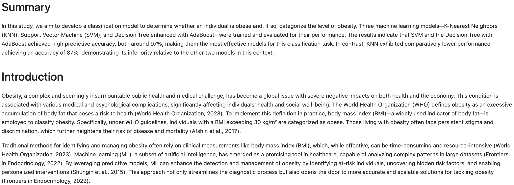

**After improvement**

Summary Section:\
- Limitation are clearly stated - "However, large portion of the dataset used in our analysis was synthetically created, while ensuring a balance dataset, this may introduce potential biases. Additionally, the data was collected from only three countries and would benefit to have data from more a diverse global population for a broader application".
- Deeper discussion of impact of work is stated - "our results show promising potential for application of machine learning in obesity diagnosis to aid healthcare professionals".
- Analysis question mentioned: "**TODO**"

Introduction Section:\
- A short description of the dataset and a brief discussion is now included in introduction. In the Data section under Methods, a more detailed discussion is added to elaborate the strengths and limitations of the dataset. This discussion addresses the TA's feedback regarding why this dataset is chosen.
- Research question is clearly stated and relevance of input variables is discussed.

These changes were done through series of commits, some are listed below. However as this could be tedious, screenshots of the summary and introduction section are available in these paths from the root directory:  and \
[Commit 5288ac1](https://github.com/UBC-MDS/obesity-classifier-group17/commit/5288ac19928446b7f5a633904ec2db7fe985c0a0)\
[Commit 57a6658](https://github.com/UBC-MDS/obesity-classifier-group17/commit/57a665865f8142ec2cce09f01cb9a2eb51e77f34)

## Improvement 3

The following feedback was provided by the peers in the other groups for Milestone 3:

**Feedback received**\
\
 
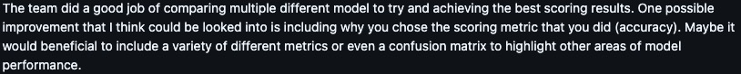

**Initial state (before improvement)**\
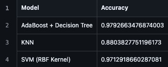\

**After improvement**\
We added precision and recall for the support metrics to evaluate the final model. Because we don't focus on the certai levels in the target, we average the precision and recall scores for all the target levels. \
\
 
Here comes the commit for this improvement: \
[Commit 49908af](https://github.com/UBC-MDS/obesity-classifier-group17/commit/49908afb7786d8b285a232d21f379d1b4096ec4f)

## Improvement 4

The following feedback was provided by another peer in the another group for Milestone 3:\

**Feedback received**\

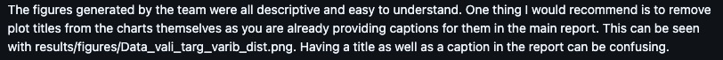\

**Initial state (before improvement)**\
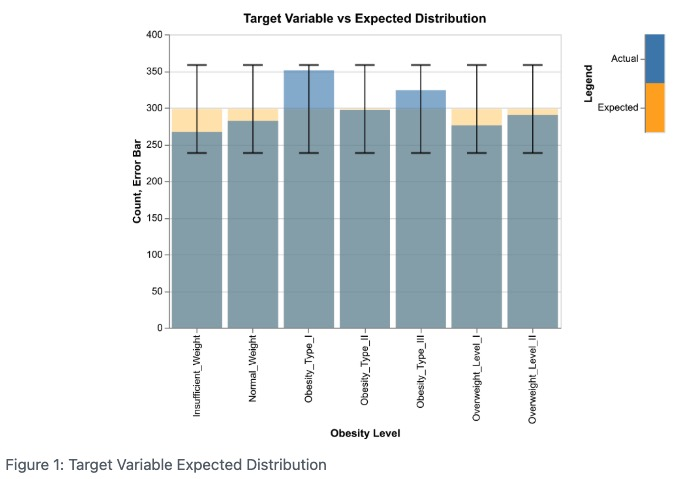\

**After improvement**\
We removed all of the duplicate titles for the figures which are already included in description.\
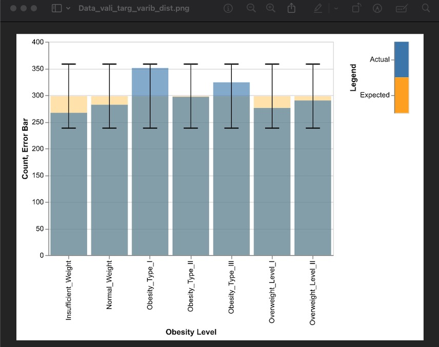\
 
Here comes the commit for this improvement: \
[Commit 4ba64ac](https://github.com/UBC-MDS/obesity-classifier-group17/commit/4ba64ac55e842ce8c8b137720f1030cfd9bf7830)

## Improvement 5

The following feedback was provided by the TA for Milestone 2 regarding our Data Validation section:\

**Feedback received**\

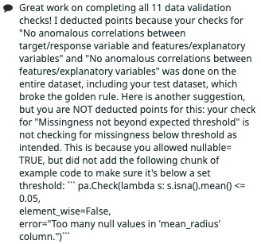\

**Initial state (before improvement)**\
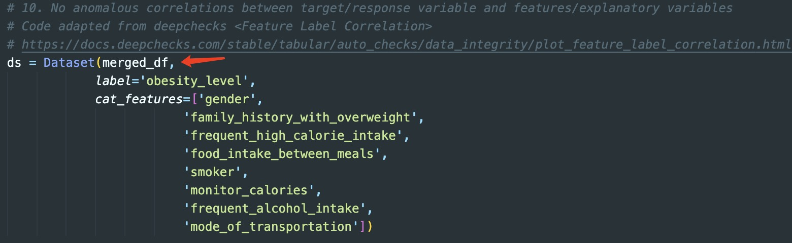\

**After improvement**
We fixed the data leakage issue in data validation correlation check steps. The data set now is the training set after splitting.\
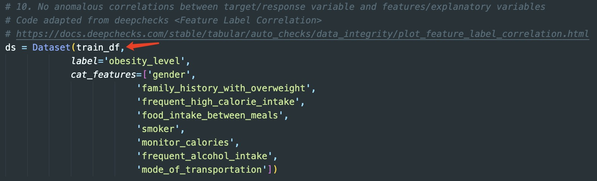\
 
Here comes the commit for this improvement: \
[Commit 2e759d8](https://github.com/UBC-MDS/obesity-classifier-group17/commit/2e759d83a267b9f85df67cd126feaec12aa12ff0)

## Improvement 6

<Describe>

**Feedback received**

**Initial state (before improvement)**

**After improvement**

## Improvement 7

<Describe>

**Feedback received**

**Initial state (before improvement)**

**After improvement**

## Improvement 8

<Describe>

**Feedback received**

**Initial state (before improvement)**

**After improvement**
