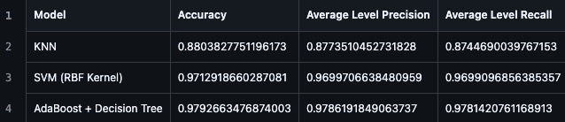

# Changelog

This document contains records of the improvements we have made to our project based on the feedback we have received from the DSCI 522 teaching team and peer reviews.\
Each section highlights the feedback provided, the state of the project before the change, and the state of the project after improvements.

## Improvement 1

Improvement by: Sepehr

Our `environment.yml` file initially listed dependencies incorrectly. Feedback from TA informed us that we did not pin version directly using `=`, but used `>=` instead.\
Upon review, a mistake in version specification for `ucimlrepo` was also found (`ucimlrepo==0.0.7` instead of `ucimlrepo=0.0.7`).

### Changes made

- Updated `jupyterlab>=3.5` to `jupyterlab=3.5`, but removed this dependency as it is redundant.
- Updated `pip>=24.2` to `pip=24.2`
- Updated `ucimlrepo==0.0.7` to `ucimlrepo=0.0.7`

**Feedback received**

**Initial state (before improvement)**

**After improvement**

Link to commit changes:\
[Commit 8210652](https://github.com/UBC-MDS/obesity-classifier-group17/commit/8210652a3081cb35eca308751275b016555b41e4)\
[Commit 82cd5b7](https://github.com/UBC-MDS/obesity-classifier-group17/commit/82cd5b77c53619cad695880a5edc2d8e307e5cc9#diff-9efd195f4e9bfb79ccd456a1d8370fafcc4bcb0b00ea3799222667d2ae818533L20)
[Commit 99889d7](https://github.com/UBC-MDS/obesity-classifier-group17/commit/99889d7948a44595cc42ab6dd2a38c10f73aa51c)

## Improvement 2

Improvement by: Sepehr

The following feedback was provided by the TA for Milestone 1 regarding our Summary and Introduction section:

**Feedback received**\
\

**Initial state (before improvement)**\

**After improvement**

Summary Section:
- Limitations are clearly stated - "However, large portion of the dataset used in our analysis was synthetically created, while ensuring a balance dataset, this may introduce potential biases. Additionally, the data was collected from only three countries and would benefit to have data from more a diverse global population for a broader application".
- Deeper discussion of impact of work is stated - "our results show promising potential for application of machine learning in obesity diagnosis to aid healthcare professionals".
- Analysis question mentioned in the summary.

Introduction Section:
- A short description of the dataset and a brief discussion is now included in introduction. In the Data section under Methods, a more detailed discussion is added to elaborate the strengths and limitations of the dataset. This discussion addresses the TA's feedback regarding why this dataset is chosen.
- Research question is clearly stated and relevance of input variables is discussed.

These changes were done through series of commits, some are listed below. However as this could be tedious, screenshots of the summary and introduction section are available in these paths from the root directory (Alternatively, the report can be viewed instead):\
path for Summary screenshot: `img/Improvement_2_Summary.png`\
path for Introduction screenshot: `img/Improvement_2_Intro.png`\
[Commit 5288ac1](https://github.com/UBC-MDS/obesity-classifier-group17/commit/5288ac19928446b7f5a633904ec2db7fe985c0a0)\
[Commit 57a6658](https://github.com/UBC-MDS/obesity-classifier-group17/commit/57a665865f8142ec2cce09f01cb9a2eb51e77f34)

## Improvement 3

Improvement by: Yun Zhou

The following feedback was provided by the peers in the other groups for Milestone 3:

**Feedback received**\
\
 

**Initial state (before improvement)**\
We only included accuracy in our results table.\

**After improvement**\
We added precision and recall for the support metrics to evaluate the final model. As the focus is not on specific level of the target variable, we calculated the average precision and average recall
across all target levels. This ensures a more comprehensive evaluation of the model's performance.\

 
Commit link for this improvement:\
[Commit 49908af](https://github.com/UBC-MDS/obesity-classifier-group17/commit/49908afb7786d8b285a232d21f379d1b4096ec4f)

## Improvement 4

Improvement by: Yun Zhou

The following feedback was provided by another peer in the another group for Milestone 3:

**Feedback received**

**Initial state (before improvement)**\

**After improvement**\
We removed all of the duplicate titles for the figures which are already included in description.
\
 
Commit link for this improvement:\
[Commit 4ba64ac](https://github.com/UBC-MDS/obesity-classifier-group17/commit/4ba64ac55e842ce8c8b137720f1030cfd9bf7830)

## Improvement 5

Improvement by: Yun Zhou

The following feedback was provided by the TA for Milestone 2 regarding our Data Validation section and breaking the golden rule:

**Feedback received**

**Initial state (before improvement)**\

**After improvement**\
We fixed the data leakage issue in data validation correlation check steps. The correlation checks are now performed only on the training set after splitting the dataset. This ensures that the test set
remains untouched and the golden rule is followed.\
\
 
Commit link for this improvement: \
[Commit 2e759d8](https://github.com/UBC-MDS/obesity-classifier-group17/commit/2e759d83a267b9f85df67cd126feaec12aa12ff0)

## Improvement 6

Improvement by: Zanan

The following feedback was provided through peer reviews after Milestone 3. In the README.md file the instructions for developers did not include `conda-lock` and `conda` as dependencies in case additional dependencies are needed to be added. 

**After improvement**

We added `conda` and `conda-lock` version under developer notes section.

Commit link for this improvement:\
[Commit ccc753a](https://github.com/UBC-MDS/obesity-classifier-group17/commit/ccc753a0bedd99380ce26d3ba501bdf63c5aca38)

## Improvement 7

Improvement by: Zanan

The following feedback was provided through peer reviews after Milestone 3. It refers to the lack of visual aids, apart from Figure 1, in our report to communicate more effectively.

**Initial state (before improvement)**

Initially, we only had Figure 1, which referred to the class distribution of the target. This lack of visual represetation made the report less comprehensible.

**After improvement**

We added 2 more distribution plots for categorical and numerical features and a brief summary. The plots were generated through our EDA.
\

Commit link for this improvement:\
[Commit 3b33f68](https://github.com/UBC-MDS/obesity-classifier-group17/commit/3b33f68dd6f8a4065f68b97906a04e430c41109a)

## Improvement 8

Improvement by: Sepehr

The following feedback was provided by the TA for Milestone 1 regarding the Method section:

**Feedback received**

\

**Initial state (before improvement)**

As mentioned in the feedback from TA, our Method section lacked clarity regarding metrics used for HP optimization, why dataset was balanced, which features were used in the mode, why synthetic data was generated, and limitation of SMOTE filter.

**After improvement**

Following were included in the Method section:
- Clearly specified accuracy as a metric for hypterparameter optimization.
- Mentioned that dataset is balanced and added plot
- Explained all features were used in model training and why
- Added explanation why synthetic data was used, emphasizing the need for class balance
- Clarified SMOTE filter as limitation.

These changes were done through series of commits listed below. As it could be tedious to go through all commits, screenshots of the Method section are available in these paths from the root directory (alternatively, the report html can be viewed instead) to review method section:\
path for Method - Data screenshot: `img/improvement_8_method_data.png`\
path for Method - analysis screenshot: `img/improvement_8_method_analysis.png`

Commit link for this improvement:\
[Commit 06fab17](https://github.com/UBC-MDS/obesity-classifier-group17/commit/06fab17cf6daf96cf4af7490bfad1509d7ac9ba6)\
[Commit 844ac5a](https://github.com/UBC-MDS/obesity-classifier-group17/commit/844ac5a6df3735ff7bf7a24244d830e3294a94b0)\
[Commit 5288ac1](https://github.com/UBC-MDS/obesity-classifier-group17/commit/5288ac19928446b7f5a633904ec2db7fe985c0a0)

## Improvement 9

Improvement by: Sepehr

Feedback was provided by TA in office hours that after milestone 3 some values in the report, specifically number of rows and features of the dataset, were hardcoded rather than using inline code. 

**Initial state (before improvement)**

\
\

**After improvement**

We used inline code to refer to shape of the data frame. This improves accuracy by reducing errors, improves transparency, and promotes reproducibility.\
\
\

Commit link for this improvement:\
[Commit 1796b22](https://github.com/UBC-MDS/obesity-classifier-group17/commit/1796b2211a8c9db2e4e87e9bd7f7c97a4a8c41be)
